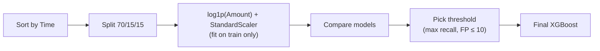
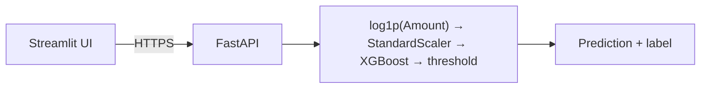

# 💳 Credit Card Fraud Detection — End-to-End ML/MLOps System

<p align="center">
  
  
  
  
  
  
  
  
  
</p>

<p align="center">
  <b>Fraud detection built for a real operating constraint: catch as much fraud as possible without flooding reviewers with false alarms.</b>
</p>

---

## Table of Contents

1. [Overview](#1-overview)
2. [Approach](#2-approach)
3. [Final Model & Results](#3-final-model--results)
4. [Model Comparison](#4-model-comparison)
5. [Key Findings](#5-key-findings)
6. [Architecture & API](#6-architecture--api)
7. [Run & Deploy](#7-run--deploy)
8. [Limitations](#8-limitations)
9. [Author](#9-author)

---

## 1. Overview

Given a transaction, the system returns a **fraud probability**, the **decision threshold**, a **0/1 prediction**, and a **label** (`Fraud` / `Legitimate`).

- **Data:** [Kaggle credit card dataset](https://www.kaggle.com/datasets/saurabhbadole/credit-card-dataset) — 284,807 transactions, 30 features (`Time`, anonymized `V1`–`V28`, `Amount`), ~0.17% fraud.
- **Objective:** maximize fraud **recall** with at most **10 false positives** on validation. Accuracy is ignored because it is meaningless at this imbalance.
- **Delivered:** trained model → FastAPI service → Streamlit UI → Docker images → GitHub Actions → Render.

---

## 2. Approach



- **Chronological split, not random.** The model is always tested on transactions *later* than it trained on, which avoids leaking future patterns.
- **Threshold tuned on validation** and saved separately from the model, so the decision boundary can change without retraining.
- **Test set never used for selection.**

| Split | Rows | Frauds |
|---|---|---|
| Train | 198,608 | 366 |
| Validation | 42,559 | 55 |
| Test | 42,559 | 52 |

---

## 3. Final Model & Results

**XGBoost with early stopping** (best iteration 100, `max_depth=6`, `learning_rate=0.05`, `random_state=42`). Decision threshold: **0.0913**.

| | Precision | Recall | F1 | PR-AUC | FP | FN |
|---|---|---|---|---|---|---|
| Validation | 0.857 | 0.873 | 0.865 | 0.885 | 8 | 7 |
| **Test** | **0.765** | **0.750** | **0.757** | **0.762** | **12** | **13** |

> **The test row is the realistic estimate.** Validation was also used for early stopping and threshold selection, so a drop on later, unseen data is expected.

---

## 4. Model Comparison

Validation results at the `FP ≤ 10` operating point.

| Model | PR-AUC | Recall | FP | Training time |
|---|---|---|---|---|
| **XGBoost, early stopping (selected)** | **0.885** | **0.873** | 8 | **6.3 s** |
| XGBoost 90% + neural net 10% blend | 0.883 | 0.855 | 10 | – |
| Ensemble (XGBoost / RF / CatBoost) | 0.876 | 0.818 | 3 | – |
| Neural net (BatchNorm + focal loss) | 0.861 | 0.782 | 6 | 21.9 s* |
| H2O AutoML (XRT) | 0.854 | 0.818 | 7 | 6 min 20 s† |
| XGBoost + SMOTE | 0.854 | 0.782 | 7 | – |
| Neural net (class weights) | 0.852 | 0.782 | 4 | 18.7 s* |
| XGBoost + undersampling | 0.841 | 0.782 | 10 | – |
| Autoencoder (unsupervised) | – | 0.000 | 10 | – |

**Test-set check of the neural nets** (thresholds fixed on validation, run after XGBoost was frozen, for comparison only):

| Model | Precision | Recall | F1 | PR-AUC | FP | FN |
|---|---|---|---|---|---|---|
| XGBoost (production) | 0.765 | 0.750 | 0.757 | 0.762 | 12 | 13 |
| Neural net (focal loss) | 0.867 | 0.750 | 0.804 | 0.759 | 6 | 13 |
| Neural net (class weights) | 0.837 | 0.692 | 0.758 | 0.769 | 7 | 16 |

---

## 5. Key Findings

- **XGBoost was selected by a rule fixed in advance:** it caught the most fraud on validation (48 of 55, vs. 43 for both neural nets) and trained about 3× faster.
- **Neural nets were competitive, not clearly worse.** On test, the focal-loss network matched XGBoost's recall with half the false positives. With only 52 test frauds, one transaction moves recall ~1.9 points, so these gaps are within noise.
- **Blending, resampling (SMOTE, undersampling), and the autoencoder did not help.** The autoencoder detected 0 of 55 frauds within the false-positive budget.
- **Drift is present** between train and test (PSI > 0.25 on `Time`, `V1`, `V3`, `V28`, `V11`), but the model's top features (`V10`, `V14`) shifted little. Monitor for drift after deployment.
- **Neural-net results are not reproducible run to run.** No TensorFlow seed was set, and a notebook re-run changed them noticeably (e.g., MLP validation PR-AUC 0.709 vs. 0.852). XGBoost results were identical.

---

## 6. Architecture & API



Artifacts in `models/`: `final_fraud_xgboost_model.json`, `final_fraud_scaler.pkl`, `final_fraud_threshold.pkl`. The model is saved as **native XGBoost JSON**, because the pickle failed to load across environments (`input stream corrupted`) even though its SHA-256 matched.

| Endpoint | Description |
|---|---|
| `GET /health` | Service and model status |
| `POST /predict` | Takes `Time`, `V1`–`V28`, `Amount` |
| `GET /docs` | Swagger UI |

```json
{ "fraud_probability": 0.9572, "threshold": 0.0913, "prediction": 1, "prediction_label": "Fraud" }
```

Experiments are tracked in MLflow (`Credit Card Fraud Detection`); the final model is registered as `CreditCardFraudXGBoost` v1.

---

## 7. Run & Deploy

```bash
git clone https://github.com/KashishPundir/CreditCard-Fraud-Detection.git
cd CreditCard-Fraud-Detection
pip install -r requirements.txt

uvicorn app:app --port 8000        # API → http://localhost:8000/docs
streamlit run streamlit_app.py     # UI  → http://localhost:8501
```

**Docker:**

```bash
docker build -t fraud-detection-api -f Dockerfile .
docker build -t fraud-detection-ui  -f Dockerfile.ui .
docker network create fraud-network
docker run -d --network fraud-network -p 8000:8000 fraud-detection-api
docker run -d --network fraud-network -p 8501:8501 fraud-detection-ui
```

**CI/CD:** on push or pull request to `main`, GitHub Actions checks the app imports, builds both images, and pushes them to Docker Hub (`kashish1303/fraud-detection-api`, `kashish1303/fraud-detection-ui`; secrets `DOCKERHUB_USERNAME`, `DOCKERHUB_TOKEN`). **Render redeploys are manual**; there is no automated deploy hook.

---

## 8. Limitations

- Only 52 frauds in the test set, so metrics are noisy.
- Test performance is clearly below validation, and drift is present.
- Neural-net results come from a single unseeded run; training times were recorded for only a few models.
- Demo scale only: no authentication, load testing, automated API tests, or real financial data.

**Next steps:** seed and multi-run the neural nets, drift monitoring, API tests in CI, automated deployment.

---

## 9. Author

**Kashish Pundir** · [GitHub](https://github.com/KashishPundir/CreditCard-Fraud-Detection)

*Fraud detection is about trade-offs, not accuracy — this project is built around making that trade-off explicit.*
*If you found this useful, a ⭐ on the repo is appreciated.*
